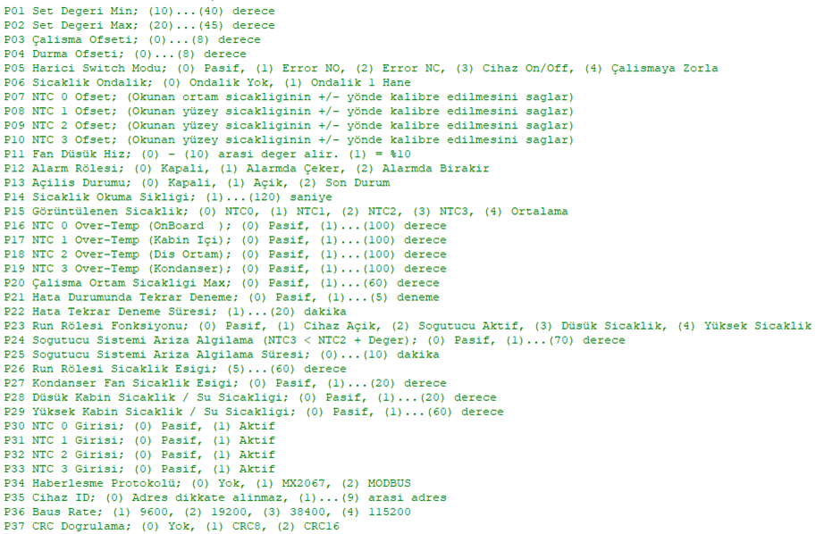

**RS485 Communication Protocol**

### General Information
The device's RS485 communication protocol is defined as follows.



**Connection Settings:**  
9600 baud, 8 data bits, No parity, 1 stop bit (baud rate is selectable from the device).

### New Parameters
The updated parameter list is provided below. Parameters **P34** and onward have been newly added.

### Device Addressing (Multi-Device Support)
- RS485 Device Address can be set between **1–9** to allow multiple devices to be connected in parallel.
- Default address is **1**.

### Communication Mode
- The PLC / Raspberry Pi acts as the **Master**.
- The device acts as a **Slave** — it only responds when polled and does not send data unsolicited.

### Command Format (from Raspberry Pi / Master)
All values are sent in **HEX**.

**Frame Structure:**
```
Start Byte + ID + Command + DataH + DataL + CRCH + CRCL + STOP BYTE1 + STOP BYTE2
   0x3A    + 0x01 +  0x67  + 0x00  + 0x00  + 0x00 + 0x00 +    0x0D    +   0x0A
```

> **Note:** Since CRC calculation can be complex, **CRCH** and **CRCL** are set to `0x00`.

---

### Command List (HEX / Decimal)

| HEX   | Decimal | Description                          |
|-------|---------|--------------------------------------|
| 0x64  | 100     | Communication Test                   |
| 0x65  | 101     | Device Reset / Reboot                |
| 0x66  | 102     | Change Set Value                     |
| 0x67  | 103     | Device ON                            |
| 0x68  | 104     | Device OFF                           |
| 0xCA  | 202     | Read Set Value                       |
| 0xCB  | 203     | Read NTC0 (Internal Box Sensor)      |
| 0xCC  | 204     | Read NTC1                            |
| 0xCD  | 205     | Read NTC2                            |
| 0xCE  | 206     | Read NTC3                            |
| 0xCF  | 207     | Read Outputs                         |
| 0xD0  | 208     | Read Inputs                          |
| 0xD1  | 209     | Read Fan Level (0–10)                |
| 0xD2  | 210     | **Read All Values** (Recommended)    |

---

### Responses

- For the first 5 commands (`0x64` – `0x68`), the device echoes back the sent data to confirm it received and processed the command.
- For read commands (`0xCA` and above), the requested data is returned.

### Examples

**Device ON:**
```hex
3A 01 67 00 00 00 00 0D 0A
```

**Device OFF:**
```hex
3A 01 68 00 00 00 00 0D 0A
```

**Set Temperature to 25°C** (`0x19` = 25):
```hex
3A 01 66 00 19 00 00 0D 0A
```

> Note: The device rejects values outside the min/max limits defined in the parameters.

**Read Set Value:**
```hex
Send:  3A 01 CA 00 00 00 00 0D 0A
Reply: 3A 01 19 00 00 0D 0A   → 0x19 = 25°C
```

**Read All Values (`0xD2`):**
```hex
Send:  3A 01 D2 00 00 00 00 0D 0A
Reply: 3A 01 D2 01 1E 1C 1A 1A 1B 24 01 07 0D 0A
```

**Response Data Breakdown (bold values are returned data):**

- **Hata Kodu** (Error Code)
- **Cihaz Durumu** (Device ON/OFF)
- **Set Değeri** (Set Value)
- **NTC0**
- **NTC1**
- **NTC2**
- **NTC3**
- **Çıkış Pinleri** (Output Pins)
- **Giriş Pinleri** (Input Pins)
- **Fan Seviyesi** (Fan Level)

---